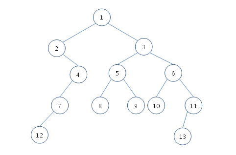

你需要在一个二叉树中找到两个顶点的最近公共祖先。例如，在下面的图中，顶点 8 和 13 的最近公共祖先是 3 和 1。其中，顶点 3 是离顶点 8 和 13 最近的。以及以顶点 3 为根的子树的大小（子树中顶点的数量）是 8。

给定一个二叉树和两个顶点，请编写一个程序，找到最近的公共祖先，并计算以最近的公共祖先为根的子树的大小。不会有输入其中一个给定顶点是另一个的祖先的情况。例如，在上面的树中，'11 和 3' 是无效的输入。因此，你的程序不必考虑这种情况。

[约束]
顶点的数量从 3 到 10000

[输入]
你将得到 10 个测试用例。每个测试用例有两行，总行数为 20。在每个测试用例中，第一行包含四个整数，V（树中的顶点数），E（边的数量）和两个顶点的索引。E 条边在下一行列出。每条边由两个顶点表示；父顶点的索引总是在子顶点的索引之前。例如，连接顶点 5 和 8 的边表示为 “5 8”，而不是 “8 5”。边的顺序没有固定规则。输入中的每个连续整数之间用空格分隔。

给定 10 个测试用例，
前 4 个测试用例包含小数量的顶点（分别为 3、5、7、10）。
接下来的 6 个测试用例包含的顶点数量相同或大于 50。

顶点的索引是从 1 到 V 的整数，根顶点的索引总是 1。
保证父顶点的索引小于子顶点的索引。
在这个问题中，子顶点是父顶点的左子树还是右子树并不重要；因此，你可以任意决定。

[输出]
在 10 行中输出 10 个答案。每一行以 “＃x” 开头，表示测试用例的索引，然后在一个空格后写下答案。答案有两个整数：最近公共祖先的索引和以最近公共祖先为根的子树的大小。这两个整数也用空格分隔。

[I/O 示例]
输入（总共 20 行）

13 12 8 13 ← 第一个输入的开始
1 2 1 3 2 4 3 5 3 6 4 7 7 12 5 9 5 8 6 10 6 11 11 13
10 9 1 10 ← 第二个输入的开始
1 2 2 3 3 4 4 5 5 6 6 7 7 8 8 9 9 10
...
输出（总共 10 行）

＃1 3 8
＃2 1 10
...

你需要在一个二叉树中找到两个顶点的最近公共祖先。例如，在下面的图中，顶点 8 和 13 的最近公共祖先是 3 和 1。其中，顶点 3 是离顶点 8 和 13 最近的。以及以顶点 3 为根的子树的大小（子树中顶点的数量）是 8。

给定一个二叉树和两个顶点，请编写一个程序，找到最近的公共祖先，并计算以最近的公共祖先为根的子树的大小。不会有输入其中一个给定顶点是另一个的祖先的情况。例如，在上面的树中，'11 和 3' 是无效的输入。因此，你的程序不必考虑这种情况。

[约束]
顶点的数量从 3 到 10000

[输入]
你将得到 10 个测试用例。每个测试用例有两行，总行数为 20。在每个测试用例中，第一行包含四个整数，V（树中的顶点数），E（边的数量）和两个顶点的索引。E 条边在下一行列出。每条边由两个顶点表示；父顶点的索引总是在子顶点的索引之前。例如，连接顶点 5 和 8 的边表示为 “5 8”，而不是 “8 5”。边的顺序没有固定规则。输入中的每个连续整数之间用空格分隔。

给定 10 个测试用例，
前 4 个测试用例包含小数量的顶点（分别为 3、5、7、10）。
接下来的 6 个测试用例包含的顶点数量相同或大于 50。

顶点的索引是从 1 到 V 的整数，根顶点的索引总是 1。
保证父顶点的索引小于子顶点的索引。
在这个问题中，子顶点是父顶点的左子树还是右子树并不重要；因此，你可以任意决定。

[输出]
在 10 行中输出 10 个答案。每一行以 “＃x” 开头，表示测试用例的索引，然后在一个空格后写下答案。答案有两个整数：最近公共祖先的索引和以最近公共祖先为根的子树的大小。这两个整数也用空格分隔。

[I/O 示例]
输入（总共 20 行）

13 12 8 13 ← 第一个输入的开始
1 2 1 3 2 4 3 5 3 6 4 7 7 12 5 9 5 8 6 10 6 11 11 13
10 9 1 10 ← 第二个输入的开始
1 2 2 3 3 4 4 5 5 6 6 7 7 8 8 9 9 10
...
输出（总共 10 行）

＃1 3 8
＃2 1 10
...
