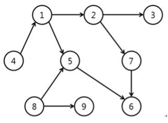

有 V 个任务要完成。有些任务只能在特定任务结束后才能开始，我们将其称为 “先决关系”。给出了表示任务先决关系的图。在这个图中，每个任务都表示为一个顶点，而先决关系表示为有向边。请注意，此图中没有循环（循环是指从一个顶点开始并返回到相同顶点的路径）。下面是这样一个图的示例：

在这个图中，任务 1 可以在任务 4 结束后开始，任务 6 可以在任务 5 和任务 7 结束后开始；这个图中没有循环。

经理 Kim 打算通过一次处理一个任务的方式完成一组具有先决关系的任务。如果他要按照上面示例中所示的任务集进行处理，可以按照以下顺序进行处理任务：

8, 9, 4, 1, 5, 2, 3, 7, 6

还有可能采用以下顺序：

4, 1, 2, 3, 8, 5, 7, 6, 9

但是，以下顺序是不可能的：

4, 1, 5, 2, 3, 7, 6, 8, 9

在这个顺序中，任务 5 的处理时间早于任务 8，但在上面给出的图的先决关系中，只有在任务 8 结束时任务 5 才能开始，因此这个顺序是不可能的。

给定 V 个任务和它们的先决关系，编写一个程序，找到一个人可以一次处理一个任务的顺序。通常有许多可能的顺序，所以你只需要展示其中之一。由于输入中没有给出带有循环的图，因此不需要考虑这种情况下的错误处理。在没有循环的图中，总是存在可能的顺序。

[约束]
图中的顶点总数 V 为 5≤V≤1000。
时间限制：1 秒钟内为 10 个测试用例组合

[输入]
给出 10 个测试用例。每两行表示一个测试用例，总共 20 行。在每个测试用例的第一行中，给出图的总顶点数 V 和总边数 E。在接下来的一行中，排列了 E 条边；边被表示为包含两个顶点。例如，从顶点 5 到顶点 28 的边表示为 “5 28”。顶点编号为 1 到 V，输入中相邻的两个数字用空格分隔。

[输出]
逐行打印 10 个测试用例的答案，共计 10 行。每一行以 “#x” 开头，留出一个空格，记录任务的顺序。对于任务的顺序，用空格分隔 V 个整数。

[输入 / 输出示例]
Input

9 9 ← 第 1 个测试用例开始
4 1 1 2 2 3 2 7 5 6 7 6 1 5 8 5 8 9
5 4 ← 第 2 个测试用例开始
1 2 2 3 4 1 1 5
...

Output（总共 10 行）
#1 8 9 4 1 5 2 3 7 6
#2 4 1 2 3 5
